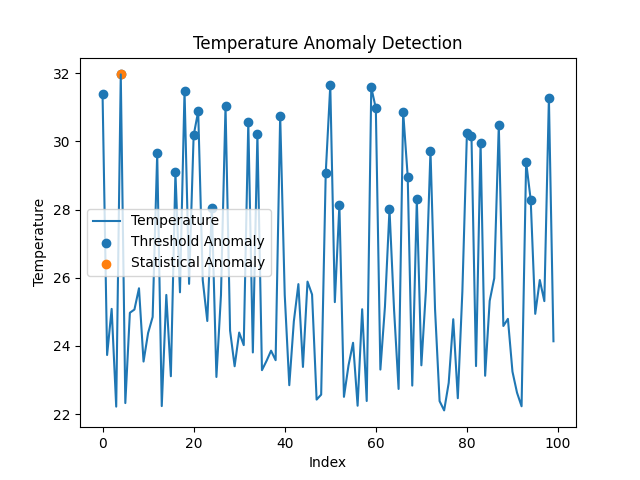
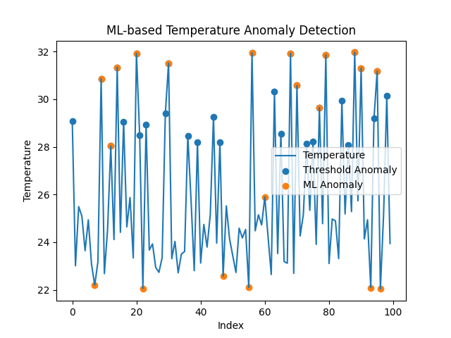
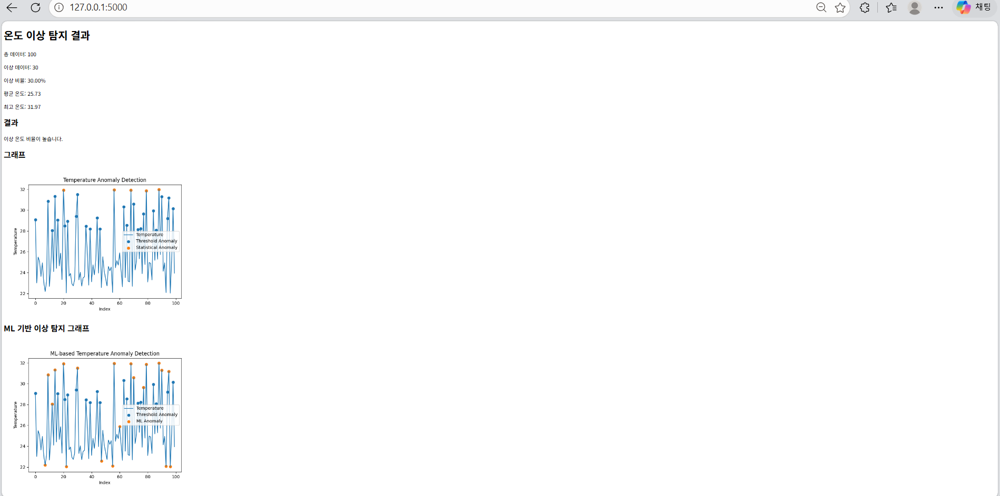

# IoT Temperature Anomaly Detection System
IoT 환경에서 온도 데이터를 생성하고, Threshold / Statistical / ML 기반 이상 탐지를 수행하는 프로젝트입니다.

## 1. 프로젝트 진행 이유
IoT 환경에서는 센서 데이터가 지속적으로 발생하기 때문에, 단순 데이터 저장이 아니라 이상 데이터를 탐지하는 과정에 관심이 생겼습니다.
처음에는 Threshold 기반 탐지를 구현했지만, 고정 기준 기반 방식의 한계를 느껴 통계 기반 및 ML 기반 탐지까지 확장하게 되었습니다.

## 2. 프로젝트 목적
기존 Threshold 기반 이상 탐지 방식의 한계를 확인하고, Statistical 및 ML 기반 이상 탐지(Isolation Forest)와 비교 분석하기 위해 프로젝트를 진행했습니다.

## 3. 프로젝트 흐름
온도 데이터 생성  
↓  
CSV 파일 저장  
↓  
Threshold 기반 이상 탐지  
↓  
통계 기반 이상 탐지  
↓  
ML 기반 이상 탐지  
↓  
그래프 시각화  
↓  
Flask 웹 서비스 출력

## 4. 사용 기술
- Python
- Pandas
- Matplotlib
- Scikit-learn
- Flask
- CSV

## 5. 주요 기능 설명
### (1) 데이터 생성
- 랜덤 온도 생성
- CSV 저장
- timestamp 기록
- 이상(anomaly) 데이터 포함

### (2) Threshold 기반 이상 탐지
온도가 특정값(28도)을 초과하면 이상 데이터로 판단했습니다.

### (3) 통계 기반 탐지
평균 및 표준편차 기반으로 비정상 데이터를 탐지했습니다.

### (4) ML 기반 탐지
- Isolation Forest 모델을 사용하여 지도 데이터 없이 이상 패턴을 탐지할 수 있도록 비지도 학습 기반 이상 탐지를 적용했습니다.
- Threshold 방식과 달리 패턴 기반 이상 탐지가 가능하도록 구현했습니다.

### (5) 이상 탐지 방식 비교  
방식 1: Threshold 기반 탐지  
특징: 특정 기준값 초과 여부 탐지  
한계: 고정 기준에 의존  

방식 2: 통계 기반 탐지  
특징: 평균과 표준편차 기반 이상 탐지  
한계: 데이터 분포 영향  

방식 3: ML 기반 탐지  
특징: Isolation Forest 기반 패턴 탐지  
한계: 데이터 품질 의존  

본 프로젝트에서는 단순 기준값 탐지 방식의 한계를 보완하기 위해 통계 기반 및 머신러닝 기반 이상 탐지를 추가 구현하고 결과를 비교했습니다.

### (6) Flask 웹 시각화
Flask 웹 서버를 통해 분석 결과와 그래프를 시각화했습니다.

## 6. 결과 이미지
### Threshold and Statistical Anomaly Detection

### ML-based Detection

### Flask web result

## 7. 문제 해결 경험

1. Python 라이브러리 설치 및 실행 경로 문제
2. matplotlib 그래프 출력 문제
3. CSV 한글 깨짐 문제
4. Flask 그래프 최신화 문제

### 1. Python 라이브러리 설치 및 실행 경로 문제
- 문제: 'pip install pandas matplotlib'을 입력했을 때 'pip: 용어가 cmdlet... 인식되지 않습니다'라는 오류가 발생했습니다.
- 해결: 'python -m pip install pandas matplotlib' 방식을 먼저 시도했고, python 명령어도 인식되지 않는 상황에서는 Windows Python Launcher인 'py'를 활용해 다음 명령어로 설치했습니다.
->py -m pip install pandas matplotlib
- 배운 점: 단순히 라이브러리를 설치하는 것뿐 아니라, python 실행경로와 windows 터미널 환경을 이해하는 것이 중요하다는 점을 배웠습니다.

### 2. matplotlib 그래프 출력 문제
- 문제: 'analyze.py'를 실행했을 때 그래프 창이 바로 뜨지 않거나 터미널에 별다른 반응이 없는 문제가 발생했습니다.
- 해결: 그래프를 화면에 출력하는 방식 대신 이미지 파일로 저장하는 방식으로 변경했습니다.
 코드는 다음과 같습니다. ->plt.savefig("graph.png")
- 배운 점: 같은 코드라도 실행 환경에 따라 결과 확인 방식이 달라질 수 있으며, 화면 출력 대신 파일 저장 방식으로 전환해 문제를 해결할 수 있음을 배웠습니다.

### 3. CSV 한글 깨짐 문제
- 문제: 'data.csv'에 한글 설명을 저장했을 때 글자가 깨져서 표시되는 문제가 발생했습니다.
- 해결: CSV 파일을 저장할 때 'encoding="utf-8-sig" 옵션을 추가했습니다. 전체 코드는 다음과 같습니다.
->with open("data.csv", "w", newline="", encoding="utf-8-sig") as file:
- 배운 점: 데이터 저장 과정에서는 값 자체 뿐 아니라 문자 인코딩 방식도 중요하며, 특히 한글 데이터를 다룰 때 인코딩 처리가 필요하다는 점을 배웠습니다.

### 4. Flask 그래프 최신화 문제
- 문제: 새로운 데이터를 생성하고 분석 코드를 다시 실행했지만, Flask 웹 페이지에서는 이전 그래프가 계속 표시되는 문제가 발생했습니다.
- 해결: 그래프 저장 경로를 Flask가 참조하는 'static' 폴더로 변경했습니다. 코드는 다음과 같습니다.
->plt.savefig("static/anomaly_graph.png"), plt.savefig("static/ml_anomaly_graph.png")
- 배운 점: Flask에서 이미지, CSS, JS 같은 정적 파일은 static 폴더에서 관리되며, 웹 페이지가 참조하는 경로와 실제 저장 경로가 일치해야 한다는 점을 배웠습니다.

## 8. 배운 점
- Threshold 방식의 한계
- ML 기반 이상 탐지 원리
- Flask 웹 서비스 구조
- 디버깅 경험

## 9. 향후 개선 방향
- 실시간 센서 연동
- 데이터베이스 저장
- 이메일 알림 기능
- MQTT 적용
- 딥러닝 기반 이상 탐지

## 10. 실행 방법
1. py main.py
2. py analyze.py
3. py ml_model.py
4. py app.py

## 11. Project Structure

- main.py: 온도 데이터 생성
- analyze.py: 데이터 분석 및 시각화
- ml_model.py: 이상 탐지 모델
- app.py: Flask 웹 실행

